# Google TV Launcher UI 分镜头解析

> **视频时长**：61 秒
> **提取帧数**：21 帧（每 3 秒一帧）
> **分析日期**：2026-05-12
> **参考设备**：小米电视 / Android TV

---

## 📺 场景一：启动画面

### Frame 001 — 黑屏启动

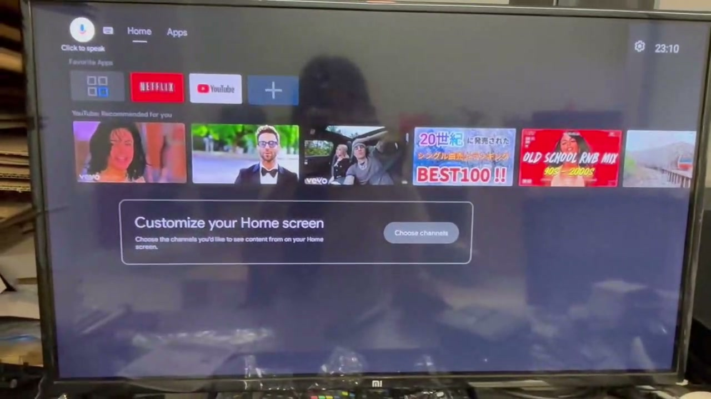

**时间**：约 0:03

**画面描述**：
- 黑屏状态，底部显示白色 **MI** Logo
- 典型的 Android TV 开机启动画面

**UI 要点**：
- 启动时品牌露出
- 无其他干扰元素

---

## 🏠 场景二：Home 主界面

### Frame 002 — Home 页首次出现

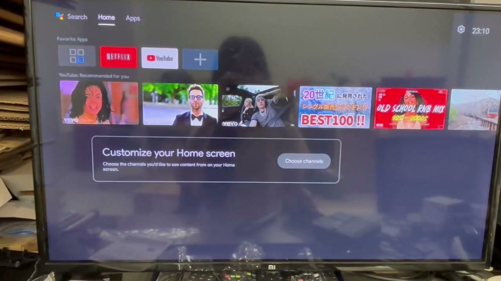

**时间**：约 0:06

**画面描述**：
- 顶部出现 **"For you"** 标签页（当前选中）
- 右上角有搜索🔍、麦克风🎤、设置⚙️图标
- 底部显示 "Apps" 标签页
- 页面正在加载中（内容区域为灰色占位）

**UI 组件拆解**：
| 组件 | 位置 | 样式 |
|------|------|------|
| 顶部 Tab 栏 | 左上 | "For you" / "Apps" 标签切换 |
| 搜索按钮 | 右上 | 🔍 图标 |
| 语音按钮 | 右上 | 🎤 图标 |
| 设置按钮 | 右上 | ⚙️ 图标 |

---

### Frame 003 — 内容加载完成

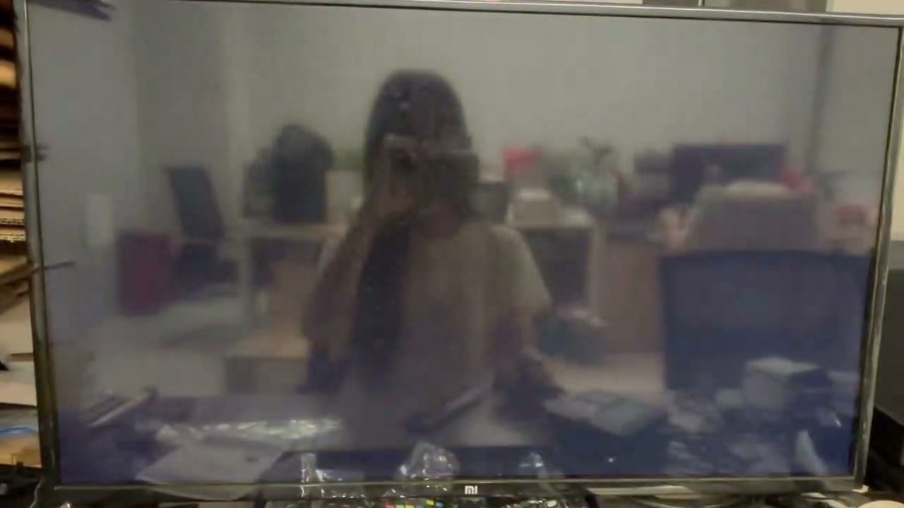

**时间**：约 0:09

**画面描述**：
- 内容区域出现推荐内容
- 出现横幅广告位（"Customize your Home screen"）
- 推荐内容横向排列，带缩略图

---

### Frame 004 — 滚动浏览推荐内容

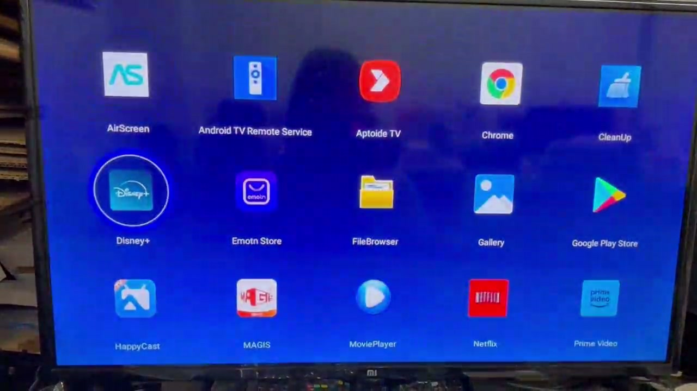

**时间**：约 0:12

**画面描述**：
- 推荐内容卡片清晰可见
- 每张卡片显示视频缩略图 + 标题
- 内容以横向滚动列表呈现

**卡片设计要素**：
- 卡片比例：约 16:9
- 圆角设计
- 底部显示内容标题
- 焦点卡片有高亮边框

---

### Frame 005 — 继续浏览推荐

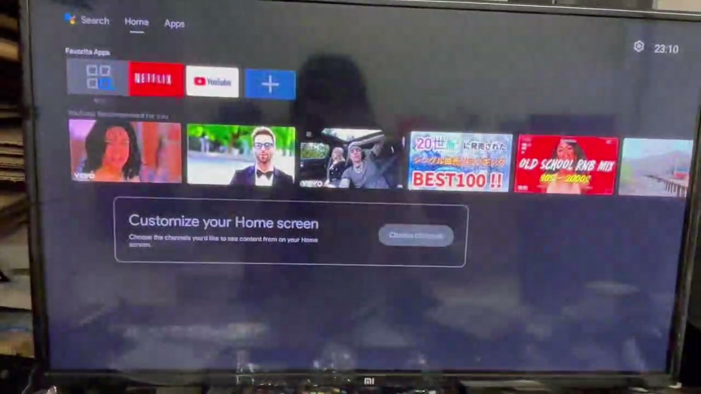

**时间**：约 0:15

**画面描述**：
- 继续横向滚动
- 多行推荐内容可见
- 每行有分类标题（如 "YouTube Recommended for you"）

---

### Frame 006 — Favorite Apps 行

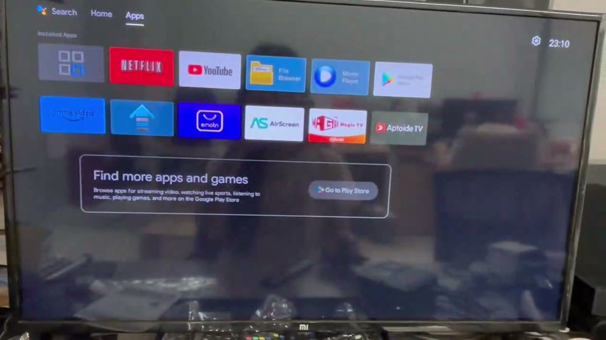

**时间**：约 0:18

**画面描述**：
- 出现 "Favorite apps" 行
- 方形 App 图标：Netflix、YouTube 等
- 每行图标尺寸一致，间距均匀

---

### Frame 007 — Apps 页面切换

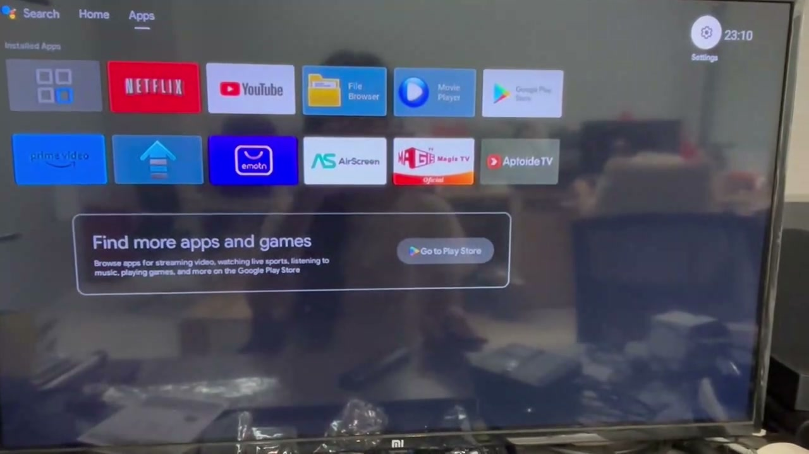

**时间**：约 0:21

**画面描述**：
- 切换到 "Apps" 标签页
- 显示已安装应用列表
- 底部出现 "Find more apps and games" 横幅
- 右侧显示设置图标和时间

**Apps 页布局**：
- 网格状排列应用图标
- 每个图标带应用名称
- 底部有 Play Store 入口

---

### Frame 008 — 设置菜单展开

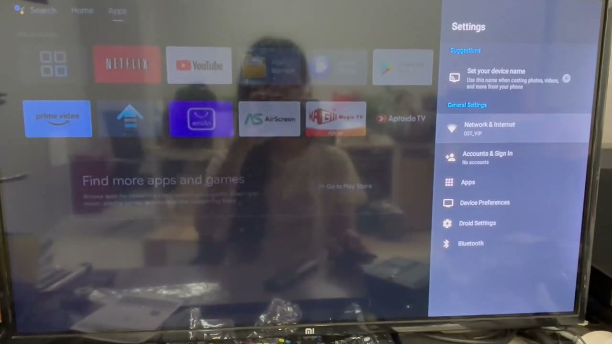

**时间**：约 0:24

**画面描述**：
- 设置菜单展开
- 显示多个设置选项：
  - Network & internet
  - Display & sound
  - Apps
  - Channels & inputs
  - Device preferences
  - Remote & accessories
  - Ambient mode

**设置项布局**：
- 左侧图标 + 右侧文字
- 列表式排列
- 右侧有 ">" 箭头表示可进入

---

### Frame 009 — 设置面板滑动

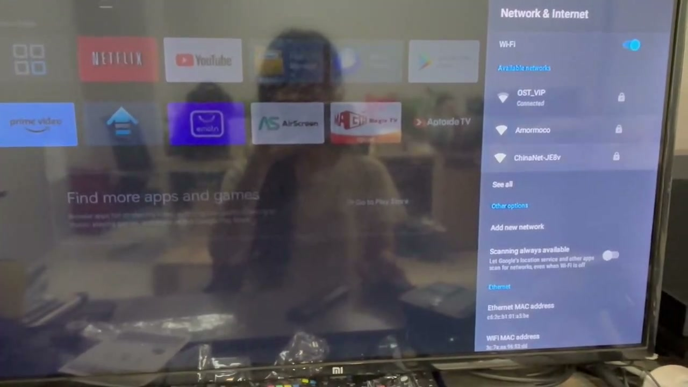

**时间**：约 0:27

**画面描述**：
- 设置面板向下滑动
- 显示更多底部选项：
  - Accessibility
  - Privacy
  - Location
  - Security & restrictions
  - Storage
  - Energy saver
  - Power

---

### Frame 010 — 设置面板底部

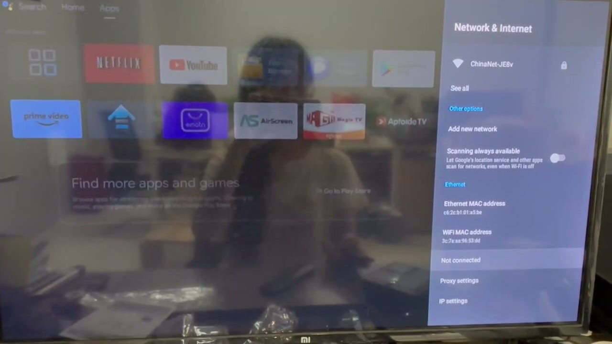

**时间**：约 0:30

**画面描述**：
- 设置面板底部：
  - About（关于设备）
  - Power（电源选项）

---

## ⚙️ 场景三：设置详情页面

### Frame 011 — Network & Internet

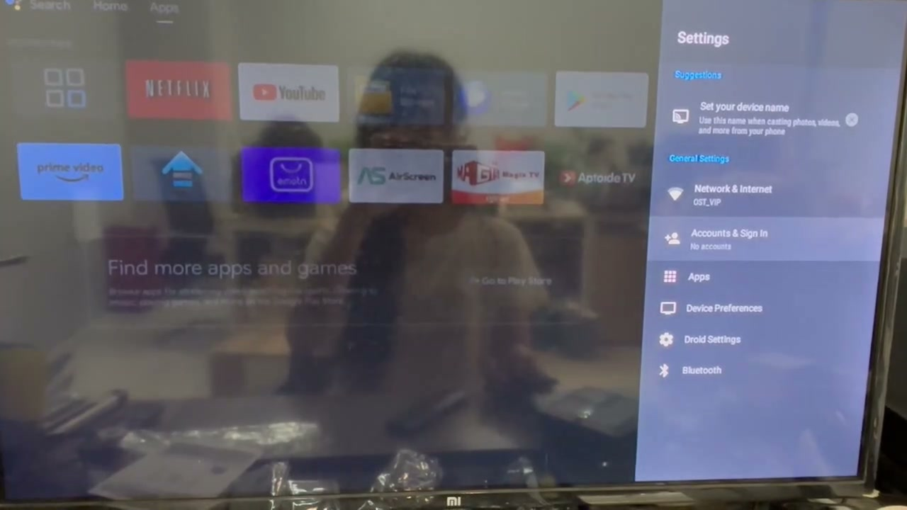

**时间**：约 0:33

**画面描述**：
- 进入 "Network & internet" 设置页
- 显示 WiFi 网络信息：
  - 当前连接的 WiFi 名称
  - 锁图标表示加密
  - WiFi 信号强度图标
- 其他选项：Scanning always available

---

### Frame 012 — 网络设置详情

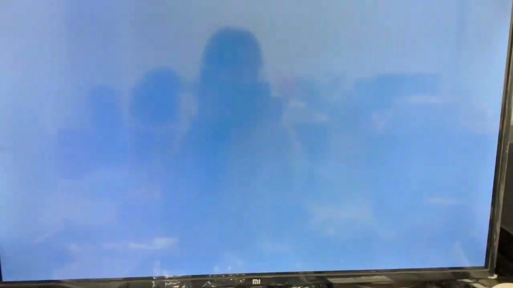

**时间**：约 0:36

**画面描述**：
- 网络设置详细信息：
  - WiFi MAC 地址
  - IP 地址（192.168.1.12）
  - Subnet mask（255.255.255.0）
  - Gateway（192.168.1.1）
  - DNS（8.8.8.8）

**技术要点**：
- 网络信息以列表形式展示
- 每项带标签说明

---

### Frame 013 — About 页面

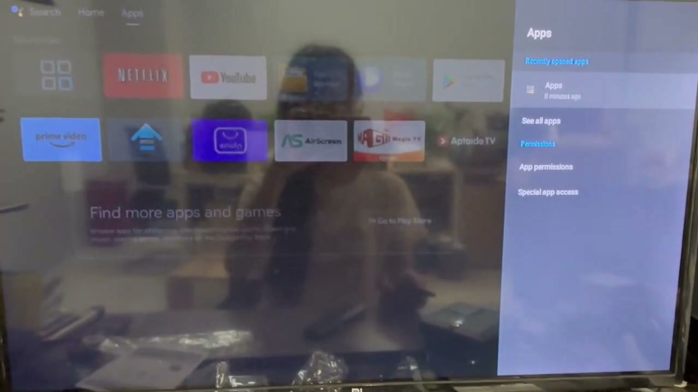

**时间**：约 0:39

**画面描述**：
- 进入 "About" 关于页面
- 显示设备信息：
  - Name: Android TV
  - Model: MiTV-MOOQ0
  - Version: 9
  - Android security patch level
  - Build number

---

### Frame 014 — About 页面滚动

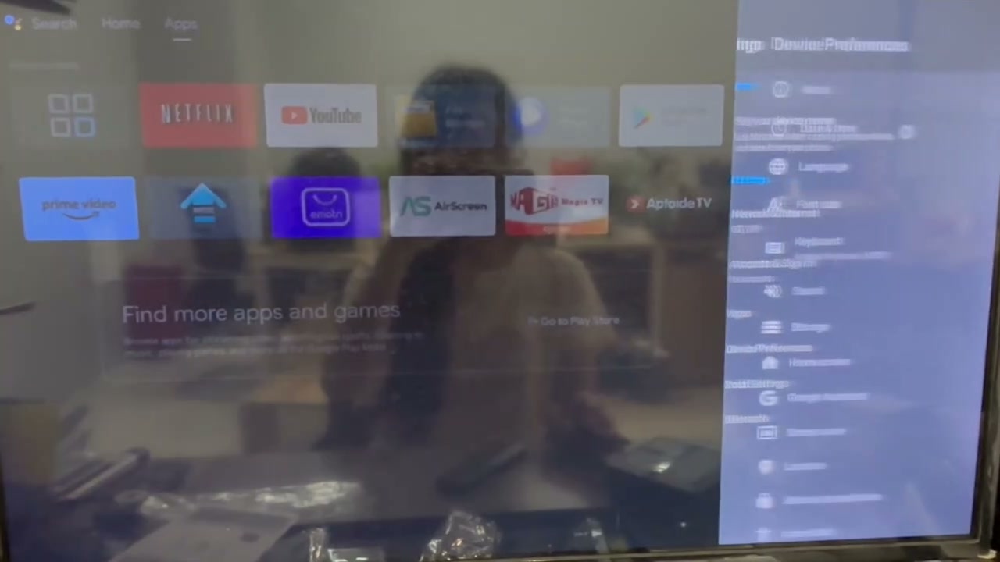

**时间**：约 0:42

**画面描述**：
- 继续查看 About 页面底部信息
- 更多系统详细信息

---

### Frame 015 — 返回设置主菜单

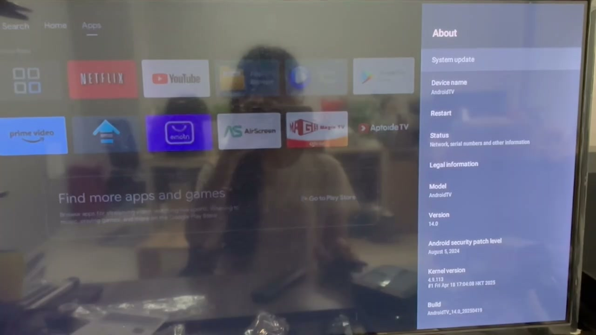

**时间**：约 0:45

**画面描述**：
- 返回设置主菜单
- 显示所有设置项列表
- 底部高亮选中 "About" 项

---

## 🔄 场景四：操作演示

### Frame 016 — 遥控器操作

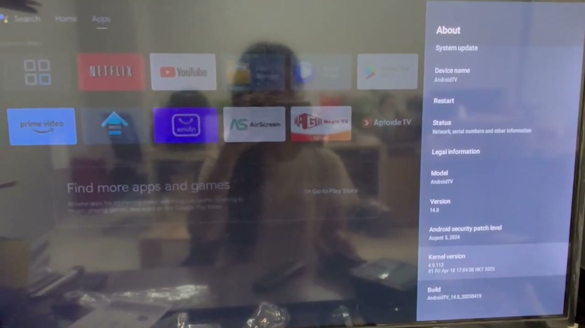

**时间**：约 0:48

**画面描述**：
- 显示遥控器操作演示
- 焦点在设置项之间移动

---

### Frame 017 — 焦点导航演示

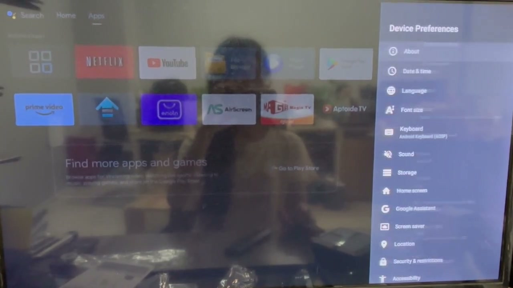

**时间**：约 0:51

**画面描述**：
- 继续演示遥控器导航
- 焦点高亮效果清晰可见

---

### Frame 018 — 返回 Home 页面

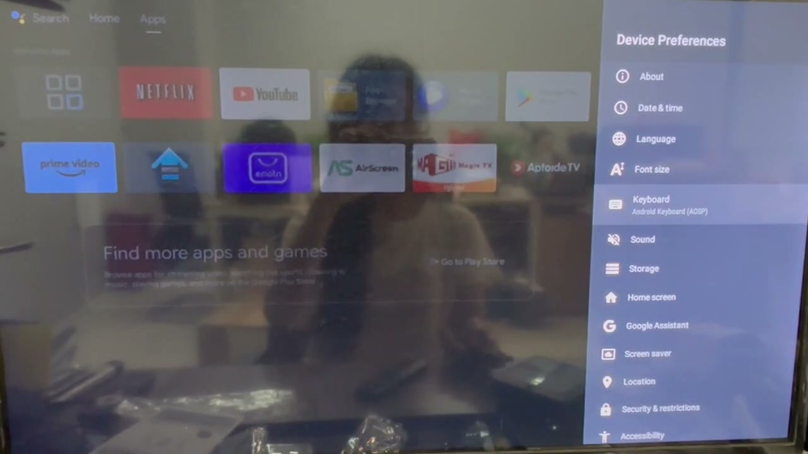

**时间**：约 0:54

**画面描述**：
- 返回 Home 主页面
- 推荐内容重新加载

---

### Frame 019 — Home 页面浏览

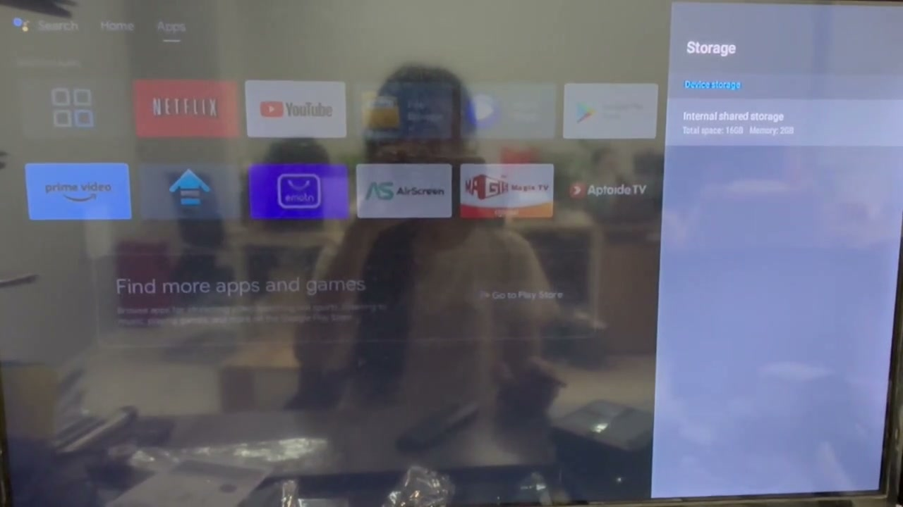

**时间**：约 0:57

**画面描述**：
- 浏览 Home 页面内容
- 横向滚动推荐列表

---

### Frame 020 — 内容详情预览

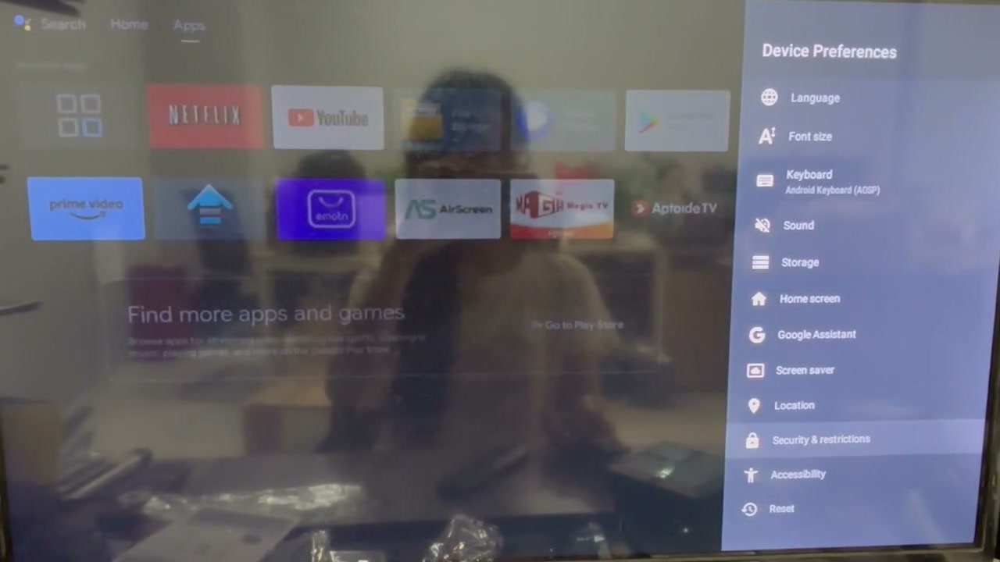

**时间**：约 0:58

**画面描述**：
- 选中某个推荐内容
- 可能显示内容详情或预览

---

### Frame 021 — 视频结束画面

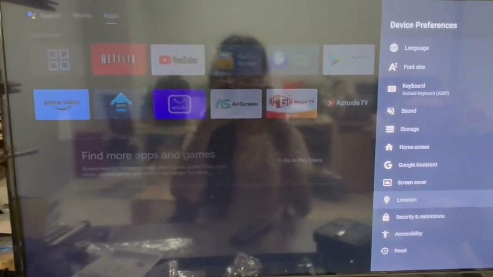

**时间**：约 1:00

**画面描述**：
- 视频结束，停留在设置页面
- 显示 "Device preferences" 等设置项

---

## 📊 UI 组件汇总表

### 核心页面

| 页面 | 关键组件 | 数量 |
|------|----------|------|
| **Home** | 顶部 Tab、推荐行、App 行、横幅 | 6+ |
| **Apps** | 应用网格、Play Store 横幅 | 2+ |
| **Settings** | 设置列表、子页面 | 15+ |

### 交互组件

| 组件 | 说明 |
|------|------|
| **Tab 切换** | For you / Apps |
| **横向滚动** | 推荐内容行 |
| **垂直滚动** | 设置列表 |
| **焦点高亮** | 遥控器选中态 |
| **卡片点击** | 打开内容详情 |

### 视觉规范

| 元素 | 规范 |
|------|------|
| **背景色** | 深色 #121212 |
| **文字色** | 白色 #FFFFFF |
| **焦点色** | 蓝色高亮 |
| **卡片圆角** | 8-12px |
| **卡片比例** | 16:9（内容）、1:1（App） |

---

## 🎯 机顶盒适配建议

### 必须保留的组件
1. ✅ 顶部 Tab 栏（Home/Apps）
2. ✅ 推荐内容行（横向滚动）
3. ✅ Favorite Apps 行
4. ✅ 设置面板（精简版）

### 建议砍掉的组件
1. ❌ Google 语音搜索 → 替换为百度语音
2. ❌ Play Store 入口 → 替换为自有应用市场
3. ❌ HDMI Input 相关设置
4. ❌ Google 账号登录

### 建议新增的组件
1. ➕ IPTV 频道入口
2. ➕ 投屏功能入口
3. ➕ USB 媒体播放
4. ➕ 中文界面支持

---

*分镜头解析完成，可直接用于 UI 设计参考和开发实现*
